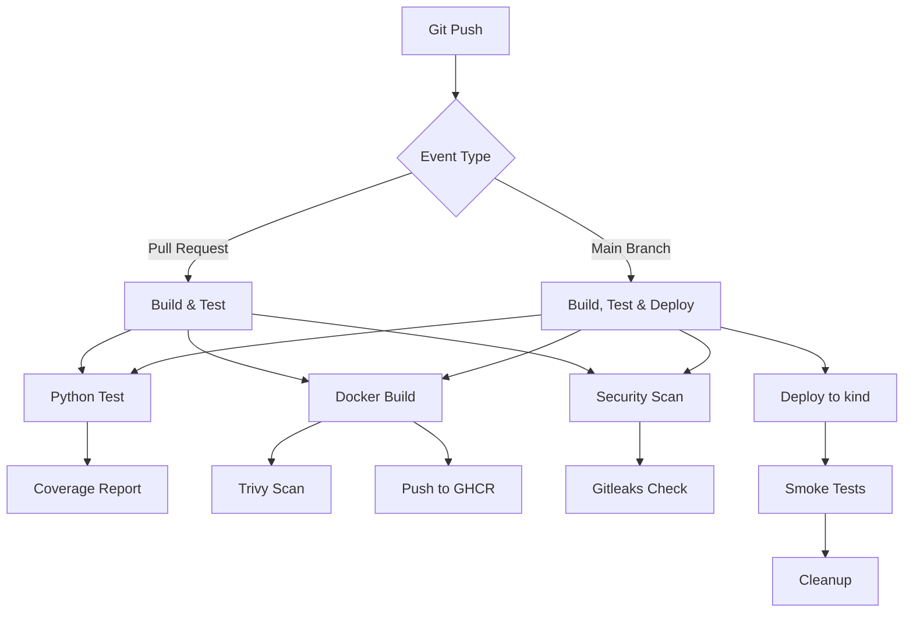

# 🔄 CI/CD Templates

Reusable GitHub Actions workflows for DevOps pipelines. These workflows demonstrate production-ready CI/CD patterns with security scanning, testing, and deployment automation.

[](https://opensource.org/licenses/MIT)
[](https://github.com)

## 📋 Overview

This repository contains reusable GitHub Actions workflows that can be called from any repository. Each workflow follows security best practices and includes comprehensive validation.

**⚠️ Privacy Notice:** All workflows are designed for demo/local environments using LocalStack and kind. No production credentials or client data are used.

## 🎯 Available Workflows

### 1. Docker Build and Scan
**File:** `.github/workflows/docker-build-scan.yml`

Multi-stage Docker builds with security scanning and multi-arch support.

**Features:**
- Multi-stage Dockerfile support
- Hadolint linting
- Trivy vulnerability scanning
- Multi-architecture builds (amd64, arm64)
- Push to GitHub Container Registry (GHCR)
- SBOM generation

**Usage:**
```yaml
jobs:
  build:
    uses: username/ci-cd-templates/.github/workflows/docker-build-scan.yml@main
    with:
      dockerfile: ./Dockerfile
      context: .
      image-name: my-app
      push: true
    secrets:
      github-token: ${{ secrets.GITHUB_TOKEN }}
```

---

### 2. Python Build and Test
**File:** `.github/workflows/python-test.yml`

Python application testing with coverage reporting.

**Features:**
- Multiple Python versions (3.9, 3.10, 3.11)
- pip dependency caching
- pytest with coverage
- Code quality checks (flake8, black, isort)
- Coverage reporting

**Usage:**
```yaml
jobs:
  test:
    uses: username/ci-cd-templates/.github/workflows/python-test.yml@main
    with:
      python-version: '3.11'
      requirements-file: requirements.txt
```

---

### 3. Terraform Validate and Plan (LocalStack)
**File:** `.github/workflows/terraform-validate.yml`

Terraform validation with security scanning using LocalStack.

**Features:**
- terraform fmt check
- terraform validate
- tflint scanning
- tfsec security scanning
- terraform plan against LocalStack
- Cost estimation (infracost)

**Usage:**
```yaml
jobs:
  validate:
    uses: username/ci-cd-templates/.github/workflows/terraform-validate.yml@main
    with:
      terraform-version: '1.6.0'
      working-directory: ./terraform
      localstack: true
```

---

### 4. Helm Lint and Deploy to kind
**File:** `.github/workflows/helm-deploy-kind.yml`

Helm chart validation and deployment to ephemeral kind cluster.

**Features:**
- helm lint
- kubeconform validation
- OPA/Conftest policy checks
- Deploy to kind cluster
- Smoke tests
- Cleanup

**Usage:**
```yaml
jobs:
  deploy:
    uses: username/ci-cd-templates/.github/workflows/helm-deploy-kind.yml@main
    with:
      chart-path: ./helm/my-app
      release-name: my-app
      namespace: default
```

---

### 5. Security Scan
**File:** `.github/workflows/security-scan.yml`

Comprehensive security scanning for repositories.

**Features:**
- Trivy filesystem scan
- Gitleaks secret scanning
- Dependency vulnerability check
- SAST scanning
- License compliance

**Usage:**
```yaml
jobs:
  security:
    uses: username/ci-cd-templates/.github/workflows/security-scan.yml@main
    with:
      scan-path: .
      fail-on-severity: HIGH
```

---

## 🏗️ Architecture



## 📦 Installation

### Using as Reusable Workflows

1. Reference workflows from your repository:

```yaml
name: CI Pipeline

on:
  push:
    branches: [ main ]
  pull_request:
    branches: [ main ]

jobs:
  test:
    uses: username/ci-cd-templates/.github/workflows/python-test.yml@main
    with:
      python-version: '3.11'
  
  build:
    needs: test
    uses: username/ci-cd-templates/.github/workflows/docker-build-scan.yml@main
    with:
      image-name: my-app
      push: ${{ github.ref == 'refs/heads/main' }}
    secrets:
      github-token: ${{ secrets.GITHUB_TOKEN }}
```

2. No additional setup required - workflows are self-contained!

## 🔒 Security Features

### Image Scanning
- **Hadolint**: Dockerfile best practices
- **Trivy**: CVE and misconfiguration scanning
- **SBOM**: Software Bill of Materials generation

### Infrastructure as Code
- **tflint**: Terraform linting
- **tfsec**: Terraform security scanning
- **Checkov**: Policy-as-code validation

### Secrets and Compliance
- **Gitleaks**: Secret detection
- **Dependency-check**: OWASP dependency scanner
- **License compliance**: Automated license checking

### Kubernetes
- **kubeconform**: Manifest validation
- **OPA/Conftest**: Policy enforcement
- **Network policies**: Default deny rules

## 🎓 Best Practices Demonstrated

1. **Security-First Approach**
   - Every artifact scanned before use
   - No long-lived credentials (OIDC where possible)
   - Least privilege access

2. **Fail Fast Philosophy**
   - Validation runs before builds
   - Tests must pass before deployment
   - Clear failure messages

3. **Reproducible Builds**
   - Version pinning for all tools
   - Dependency caching
   - Artifact attestation

4. **Observability**
   - Status badges on all workflows
   - Detailed logging
   - Metrics collection (where applicable)

## 📊 Workflow Matrix

| Workflow | Languages | Security | Deploy | LocalStack | kind |
|----------|-----------|----------|--------|------------|------|
| Docker Build | All | ✅ Trivy, Hadolint | ✅ GHCR | ❌ | ❌ |
| Python Test | Python | ✅ Bandit | ❌ | ❌ | ❌ |
| Terraform | HCL | ✅ tfsec, tflint | ✅ LocalStack | ✅ | ❌ |
| Helm Deploy | YAML | ✅ OPA, kubeconform | ✅ kind | ❌ | ✅ |
| Security Scan | All | ✅ Gitleaks, Trivy | ❌ | ❌ | ❌ |

## 🚀 Quick Start

### Example Project Setup

1. Create `.github/workflows/ci.yml` in your project:

```yaml
name: CI/CD Pipeline

on:
  push:
    branches: [ main, develop ]
  pull_request:
    branches: [ main ]

jobs:
  test:
    name: Test Application
    uses: username/ci-cd-templates/.github/workflows/python-test.yml@main
    with:
      python-version: '3.11'
      requirements-file: requirements.txt

  security:
    name: Security Scan
    uses: username/ci-cd-templates/.github/workflows/security-scan.yml@main
    with:
      scan-path: .
      fail-on-severity: HIGH

  build:
    name: Build and Scan Docker Image
    needs: [test, security]
    uses: username/ci-cd-templates/.github/workflows/docker-build-scan.yml@main
    with:
      dockerfile: ./Dockerfile
      context: .
      image-name: ${{ github.event.repository.name }}
      push: ${{ github.ref == 'refs/heads/main' }}
    secrets:
      github-token: ${{ secrets.GITHUB_TOKEN }}

  deploy-dev:
    name: Deploy to kind (Development)
    needs: build
    if: github.ref == 'refs/heads/main'
    uses: username/ci-cd-templates/.github/workflows/helm-deploy-kind.yml@main
    with:
      chart-path: ./helm/myapp
      release-name: myapp-dev
      namespace: development
```

2. Commit and push - workflows will run automatically!

## 📝 Configuration Examples

### Docker Build with Custom Registry

```yaml
jobs:
  build:
    uses: username/ci-cd-templates/.github/workflows/docker-build-scan.yml@main
    with:
      dockerfile: ./docker/Dockerfile.prod
      context: .
      image-name: my-company/my-app
      platforms: linux/amd64,linux/arm64
      build-args: |
        VERSION=${{ github.sha }}
        BUILD_DATE=${{ github.event.head_commit.timestamp }}
      push: true
    secrets:
      github-token: ${{ secrets.GITHUB_TOKEN }}
```

### Terraform with Multiple Environments

```yaml
jobs:
  validate:
    uses: username/ci-cd-templates/.github/workflows/terraform-validate.yml@main
    strategy:
      matrix:
        environment: [dev, staging, prod]
    with:
      terraform-version: '1.6.0'
      working-directory: ./terraform/${{ matrix.environment }}
      localstack: ${{ matrix.environment == 'dev' }}
```

## 🧪 Testing Workflows

Test workflows locally using [act](https://github.com/nektos/act):

```bash
# Install act
# On macOS: brew install act
# On Windows: choco install act-cli

# Run a workflow
act -W .github/workflows/docker-build-scan.yml

# Run with secrets
act -W .github/workflows/docker-build-scan.yml -s GITHUB_TOKEN=your_token
```

## 📚 Additional Resources

- [GitHub Actions Documentation](https://docs.github.com/en/actions)
- [Reusable Workflows Guide](https://docs.github.com/en/actions/using-workflows/reusing-workflows)
- [Security Hardening for GitHub Actions](https://docs.github.com/en/actions/security-guides/security-hardening-for-github-actions)

## 🤝 Contributing

This is a demo portfolio project. Feel free to use these workflows as templates for your own projects!

## 📄 License

MIT License - See LICENSE file for details

---

<div align="center">
  <b>🔒 Demo-Only Repository</b><br>
  No production credentials • LocalStack/kind emulation • Educational purposes
</div>
